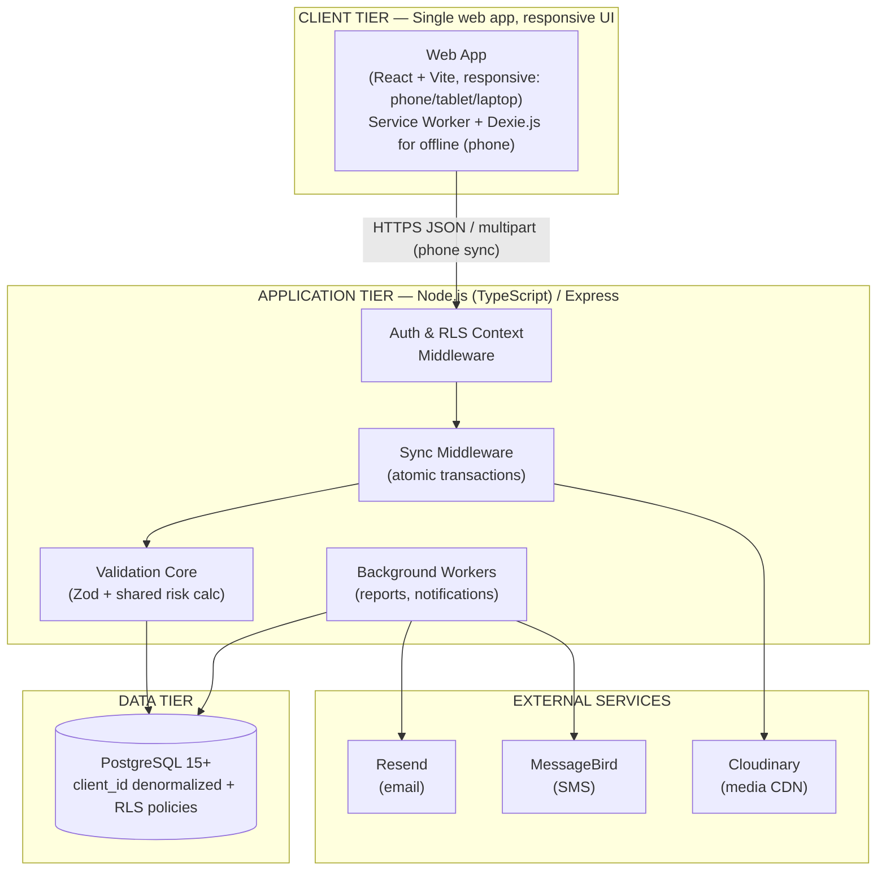

# 3. System Architecture & Directory Standards

## 3.1 System Topology Diagram & Tier Overview



> **Post-v3 amendment:** the original v2 diagram had two client nodes (Desktop Portal + Field Inspector PWA). The current product is one web app at one URL; both roles use the same client. The Service Worker + Dexie.js offline stack applies to the PWA install path (when the user adds the app to their home screen); on a laptop the same web app runs without a Service Worker but with the same routes.

> **Note (post-v2 amendment):** the original v2 diagram named SendGrid (email) and Twilio (SMS). Resend and MessageBird replace them per the ADR-008 amendment. The Puppeteer node for PDF was removed when ADR-007 was amended to PDFKit (PDF generation runs inside the report worker, not as a separate tier node).

## 3.2 Architectural Decision Records (ADR)

### v2 ADRs (carried forward)

* **ADR-001:** React (TypeScript) via Vite for frontend; Node.js (TypeScript) / Express REST API for backend. Single language across tiers.
* **ADR-002:** Dexie.js wraps IndexedDB for the mobile PWA's offline outbox and locally cached reference data.
* **ADR-003:** PostgreSQL 15+, with strict foreign keys and (per ADR-006) Row-Level Security for tenant isolation.
* **ADR-004:** Cloudinary handles media normalization (`q_auto`, `f_auto`, `c_limit` transforms). Raw EXIF is extracted client-side and stored in Postgres (`photo_evidence_metadata`) as the legal record; Cloudinary only ever holds the rendered image.
* **ADR-005:** Strict Atomic Transaction (All-or-Nothing) sync. A reference implementation is in v2 Section 8.2.
* **ADR-006 (v2):** Tenant isolation via Row-Level Security. Every tenant-scoped table carries a denormalized `client_id` column populated by `BEFORE INSERT` triggers. Postgres RLS is enabled on those tables with a policy comparing `client_id` to the session variable `app.current_client_id`, which the auth middleware sets via `SET LOCAL` at the start of every request transaction, derived from the verified JWT's `active_client_id` claim. Admin requests set `app.bypass_tenant_check = 'true'` instead. Encryption of sensitive columns at rest (phone numbers, GPS) is a separate, additive concern — see v2 Section 11.5.
* **ADR-007 (v2, amended):** Report generation uses **PDFKit** (PDF) + **`docx`** (Word) + **`exceljs`** (Excel). All run as background jobs; `/reports/generate` returns a job id, the client polls `/reports/:job_id` for status. *Amendment:* the original v2 decision used Puppeteer for PDF so the report template could reuse web design tokens. The team dropped Puppeteer to avoid shipping Chromium in the deployment image; the design tokens no longer flow automatically into the PDF — the PDF module defines its own styling.
* **ADR-008 (v2, amended):** Notification providers are **Resend** (email) and **MessageBird** (SMS). Both are wrapped behind a `NotificationProvider` interface. *Amendment:* the original v2 decision named SendGrid (email) and Twilio (SMS); both were swapped for modern API ergonomics and regional pricing respectively.
* **ADR-009 (v2):** `node-pg-migrate`. Migrations live in `apps/api-server/migrations/`, named `<timestamp>_<description>.ts`. Once merged, a migration file is never edited — only new migrations are added. CI runs all migrations against an ephemeral test database before the test suite.
* **ADR-010 (v2):** JWT access token 15-minute expiry carrying `user_id`, `role`, `active_client_id`. Refresh token 30-day sliding expiry stored in a dedicated Dexie table (`authState`), not a cookie. While offline, the device performs no token validation. Token expiry is only checked at the moment of `POST /sync/push-outbox`. If the access token is expired, the client transparently calls `POST /auth/refresh` first.

### ADR-011 (v3): Recurrence Model Simplicity

* **Status:** Approved as default; flagged for confirmation (see FR-10.4).
* **Context:** Calendar-rule recurrence (RRULE/iCal-style: "first Monday of each quarter," "every other Tuesday") is significantly more complex to generate, test, and reschedule correctly than fixed-interval recurrence.
* **Decision:** Model recurrence as `recurrence_interval_days INT`, computed forward from `next_due_date`. This covers the large majority of real inspection cadences (monthly, quarterly, annual) with a generation job simple enough to be trivially testable. If a genuine calendar-rule requirement surfaces later, it's an additive migration (add a `recurrence_rule` column, keep `recurrence_interval_days` for the simple case) rather than a rebuild.

## 3.3 Directory Structure Conventions

```text
structapp-monorepo/
├── apps/
│   ├── web-client/                 # Single web app, responsive UI (React + Vite, post-v3 amendment)
│   │   ├── public/
│   │   └── src/
│   │       ├── components/         # Shared components, layout adapts to viewport
│   │       │   ├── ui/             # design-system primitives (tokens from ui-tokens.md)
│   │       │   └── layout/         # Responsive layout primitives (navbar / app-bar / bottom-nav)
│   │       ├── routes/             # One router tree — role gates are server-enforced
│   │       ├── context/
│   │       ├── db/                 # Dexie.js table models (incl. authState, pin_outbox) — runs whenever the PWA is installed
│   │       ├── hooks/
│   │       └── views/
│   │           ├── dashboard/      # Operational Deck + Inspector Dashboard (same components, role-routed home)
│   │           ├── inspections/    # Splice Dashboard, evaluation form, calendar
│   │           ├── auth/           # Login, forgot-password, PIN fallback
│   │           └── settings/
│   └── api-server/                 # Express REST API (TypeScript)
│       ├── migrations/             # node-pg-migrate files (ADR-009)
│       └── src/
│           ├── routes/             # Express routers per resource
│           ├── controllers/
│           ├── middleware/         # incl. tenant-context.ts (sets app.current_client_id)
│           ├── services/           # report compilers, notification dispatch, import engine
│           ├── jobs/               # background workers for reports/notifications/schedule generation
│           └── config/
└── shared/
    └── types/
        └── utils/
            └── riskCalculator.ts   # single source of truth for FR-4.1 (no client/server drift)
```

## 3.4 Core API Routing Maps

> All routes are prefixed `/api/v1`. All non-auth routes require a valid access token. All list (`GET .../`) routes support pagination per Section 11.

### Auth (`/auth`)
| Method & Path | Role | Purpose |
|---|---|---|
| `POST /auth/login` | Any | Validates credentials, returns access + refresh token. If user has >1 client membership, returns a client list instead and requires a follow-up `client_id` to issue the token. |
| `POST /auth/refresh` | Any (valid refresh token) | Issues a new access token. |
| `POST /auth/logout` | Any | Revokes the refresh token server-side. |
| `POST /auth/invite/provision` | Admin | Dispatches invite token via Resend. |
| `POST /auth/invite/activate` | Any (valid invite token) | Sets `password_hash`, activates profile. |
| `POST /auth/forgot-password` | Any | Issues a single-use, 1-hour-TTL password-reset link emailed via Resend. Always returns 200 (no user enumeration). |
| `POST /auth/reset-password` | Any (valid reset token) | Sets a new `password_hash`, marks the token consumed. Second use returns `401 RESET_TOKEN_CONSUMED`. |
| `POST /auth/switch-client` | Admin, Reviewer, or Contractor (post-amendment) | Reissues access token with new `active_client_id`. Contractor is membership-validated: `403 NOT_A_MEMBER` if the target client is not in their `client_memberships` rows. Audit-logged. |

### Clients (`/clients`) — Admin only
| Method & Path | Purpose |
|---|---|
| `GET /clients` | List clients. |
| `POST /clients` | Create client (also seeds `component_types` and `work_types` picklists per FR-11.1). |
| `GET /clients/:id` | Client detail. |
| `PATCH /clients/:id` | FR-15 — Edit `name`, `safety_contact_email`. Critical. |

### Projects / Sites / Structures
| Method & Path | Role | Purpose |
|---|---|---|
| `GET /projects?client_id=` | Admin/Reviewer | List projects (RLS scopes automatically). |
| `POST /projects` | Admin/Reviewer | Create project. |
| `PATCH /projects/:id` | Admin/Reviewer | FR-15 — Edit `title`, `type`, `due_date`. Critical. |
| `GET /sites?project_id=` | Admin/Reviewer | List sites. |
| `POST /sites` | Admin/Reviewer | Create site. |
| `PATCH /sites/:id` | Admin/Reviewer | FR-15 — Edit `name`, `iana_timezone`. Critical. |
| `GET /structures?site_id=&search=&qr=` | All roles | Search/list structures; `qr=` looks up `qr_code_value` exactly for scan flows. |
| `POST /structures` | Admin/Reviewer | Create structure. |
| `PATCH /structures/:id` | Admin/Reviewer | FR-15 — Edit `asset_tag`, `description`, `qr_code_value`. Critical. `409 QR_CODE_ALREADY_IN_USE` on collisions. |
| `GET /structures/:id/history` | All roles | Past deficiencies for carry-forward triage (FR-6.2). |

### Inspections (`/inspections`)
| Method & Path | Role | Purpose |
|---|---|---|
| `GET /inspections?status=&inspector_id=` | All roles (RLS-scoped) | List inspections. |
| `POST /inspections` | Admin/Reviewer | Assign a new inspection (FR-6.1). Fires `notifyInspectionAssigned` (FR-12.1). |
| `GET /inspections/:id` | All roles | Detail incl. deficiencies + photos. |
| `POST /inspections/:id/submit` | **Contractor** | FR-13 — explicit submission. Requires synced deficiencies or `no_deficiencies_found: true`. |
| `POST /inspections/:id/return` | Reviewer/Admin | Bounce to field with mandatory `returned_reason`. Fires `notifyInspectionReturned` (FR-12.1). |
| `POST /inspections/:id/approve` | Reviewer/Admin | Approve; locks deficiencies (FR-7.1). |
| `POST /inspections/:id/reopen` | **Admin only** | FR-9 — exits `Approved`; requires `target_status` + `reason`. |
| `PATCH /inspections/:id/reassign` | Admin/Reviewer | FR-15 — Reassign `inspector_id` (and optional `scheduled_date`). Critical. FR-18.2 — also sends a notification to the previous inspector. |
| `POST /inspections/bulk-reassign` | Admin/Reviewer | FR-18 — Bulk reassign in one transaction. Capped at 100 inspections. Returns `409 INSPECTION_APPROVED_USE_REOPEN` on Approved rows. |

### Calendar (`/inspections`) — Admin/Reviewer
| Method & Path | Purpose |
|---|---|
| `GET /inspections/calendar?from=&to=&inspector_id=` | Calendar-range view across assigned + upcoming scheduled inspections (FR-10.3). |
| `PATCH /inspections/:id/schedule` | Drag-and-drop reschedule (`scheduled_date`) and/or reassign (`inspector_id`) (FR-10.3). |

### Schedules (`/schedules`) — Admin/Reviewer
| Method & Path | Purpose |
|---|---|
| `GET /schedules?structure_id=&is_active=` | List recurrence schedules (FR-10.1). |
| `POST /schedules` | Create a schedule (structure, default inspector, interval, first due date). |
| `PATCH /schedules/:id` | Edit interval/inspector, or pause via `is_active=false`. |

### Deficiencies (`/deficiencies`)
| Method & Path | Role | Purpose |
|---|---|---|
| `GET /deficiencies/:id` | All roles | Detail. |
| `PATCH /deficiencies/:id` | Reviewer/Admin (or author if `triage_state='New'`) | FR-15 — Edit `description`, `severity`, `probability`, `consequences`. Critical. Server re-runs `calculatePriorityTier`. |
| `PATCH /deficiencies/:id/component-notes` | Any client-scoped role | FR-15 — Edit `component_notes` only. Cosmetic. |
| `PATCH /deficiencies/:id/remediation` | Any client-scoped role | FR-8.2 — advance to `Remediation_Scheduled` / `Remediated_Pending_Verification`. |
| `POST /deficiencies/:id/verify-closure` | Reviewer/Admin | FR-8.2 — sets `Verified_Closed`; requires existing `remediation_evidence` photo. |

### Sync (`/sync`)
| Method & Path | Role | Purpose |
|---|---|---|
| `POST /sync/pull-package` | Contractor | Downloads assigned inspections, structure metadata, historical deficiency summaries. |
| `POST /sync/push-outbox` | Contractor | Atomic ingestion of offline batch (v2 Section 8.2). |

### Timesheets (`/timesheets`)
| Method & Path | Role | Purpose |
|---|---|---|
| `GET /timesheets?user_id=&status=` | All roles (own data for Contractor) | List. |
| `PATCH /timesheets/:id` | Author (Draft only) or Reviewer/Admin | FR-15 — Edit `work_type_id`, `hours_logged`. Cosmetic if Draft, critical otherwise. |
| `POST /timesheets/:id/submit` | Contractor | Lock draft for review (FR-5.1). |
| `POST /timesheets/:id/approve` | Reviewer/Admin | Approve. |
| `POST /timesheets/:id/reject` | Reviewer/Admin | Reject with `rejection_reason`. |

### Photos (`/photos`)
| Method & Path | Role | Purpose |
|---|---|---|
| `GET /photos/:id` | All roles | Detail with EXIF metadata. |
| `PATCH /photos/:id` | Author or Reviewer/Admin | FR-15 — Edit `caption`, `display_order`, `purpose`. Cosmetic. |
| `DELETE /photos/:id` | Author (while parent not Approved) or Reviewer/Admin | Soft-delete by setting `deleted_at`. |

### Imports (`/imports`) — Admin
| Method & Path | Purpose |
|---|---|
| `POST /imports/batches` | Upload CSV; creates `import_batches` + validates into `import_rows` (FR-2). |
| `GET /imports/batches/:id` | View validation results per row. |
| `POST /imports/batches/:id/commit` | Atomically commit all `Valid` rows (FR-2.3). |
| `POST /imports/batches/:id/discard` | Discard the batch. |

### Reports (`/reports`) — Reviewer/Admin
| Method & Path | Purpose |
|---|---|
| `POST /reports/generate` | Body: `{ type: "draft_pdf" \| "final_pdf" \| "word" \| "excel", project_id }`. Returns `{ job_id }`. |
| `GET /reports/:job_id` | Poll status; returns a signed download URL when `status: "ready"`. |

### Picklists (`/component-types`, `/work-types`) — Admin/Reviewer
| Method & Path | Purpose |
|---|---|
| `GET /component-types` / `GET /work-types` | List (active by default, `?include_inactive=true` to see all). |
| `POST /component-types` / `POST /work-types` | Add a client-specific entry. |
| `PATCH /component-types/:id` / `PATCH /work-types/:id` | Rename or deactivate (never hard-deleted) (FR-11.2). |

### Audit Log (`/audit-logs`) — Admin only
| Method & Path | Purpose |
|---|---|
| `GET /audit-logs?table_name=&record_id=&page=` | Read-only, paginated. `403` for any non-Admin role (FR-9.3). |

### Users (`/users`) — Admin only
| Method & Path | Purpose |
|---|---|
| `GET /users` | List, filterable by client membership. |
| `PATCH /users/:id` | FR-15 — Edit `email`, `phone_number`, `full_name`, `role`, `is_active`, `add_client_ids`, `remove_client_ids`. Critical for `role`/`is_active`/membership; cosmetic for `full_name`. |
| `POST /users/:id/resend-invite` | FR-15 — Resend the invite email via `NotificationProvider`. Critical. |
| `POST /users/:id/revoke-invite` | FR-15 — Revoke the invite. Critical. |
| `POST /users/:id/reset-password` | FR-15 — Set a temporary password and (optionally) email it. Critical. |

## 3.5 System Boundaries

| Folder | Owns |
|---|---|
| `app/` (web-client) | Single web app at one URL. Routes, components, layout primitives only. No data fetching logic. No direct DB calls. |
| `apps/api-server/src/routes/` | Express routes — wire middleware to controllers, no business logic. |
| `apps/api-server/src/controllers/` | Request validation (Zod) and response shaping. No direct DB access. |
| `apps/api-server/src/services/` | All business logic. Pure async functions, no Express types. |
| `apps/api-server/src/middleware/` | Auth, RLS context, role guards, error formatting. |
| `apps/api-server/src/jobs/` | Background workers. Take a `Pool` or service, run on a schedule. |
| `shared/` | Types and utilities shared by client and server (e.g. `riskCalculator.ts`). Never imports from `app/` or `apps/`. |

## 3.6 Data Flow

### UI Mutations (single web app)

```
User interaction in component
        ↓
Server Action / route handler
        ↓
Zod parse + controller
        ↓
Service (inside asTenant() transaction)
        ↓
Postgres write
        ↓
Audit trigger fires → system_audit_logs row
        ↓
Revalidate or redirect
```

### Agent Operations (PWA sync)

```
Inspector submits a batch from the PWA
        ↓
POST /sync/push-outbox (multipart)
        ↓
Auth middleware sets app.current_client_id from JWT
        ↓
Sync controller opens one transaction
        ↓
For each record: Zod parse → server-side risk recalc → INSERT
        ↓
After-commit hook: if any new P1 deficiency, send notifications (Resend + MessageBird)
        ↓
Response: { localId → serverId, per-record status }
        ↓
Client updates Dexie; clears outbox entries
```

### Company / Report Operations

```
User clicks Generate Report (desktop)
        ↓
POST /reports/generate
        ↓
Insert report_jobs row, status: Queued
        ↓
Return { job_id } (202 Accepted)
        ↓
reportJobWorker picks it up (node-cron / external scheduler)
        ↓
PDFKit (or docx / exceljs) renders to buffer
        ↓
Upload buffer to object storage
        ↓
Update report_jobs: status: Ready, download_url = signed URL
        ↓
Send Resend notification (report ready)
        ↓
Client polls GET /reports/:job_id → returns signed URL
```

## 3.7 Invariants

Rules the AI agent must never violate:

- API routes contain no business logic. Controllers contain no DB logic. Services contain no Express types.
- Agent / job code in `apps/api-server/src/jobs/` never imports from `apps/api-server/src/routes/` or from `apps/web-client/`.
- All server-side Postgres writes run inside `asTenant(req.user.active_client_id, ...)` — except background jobs, which pass `bypass = true` only at the outermost call.
- Every cross-tenant query is blocked at the database layer (Postgres RLS), not by application-layer `WHERE` clauses alone.
- The risk priority calculator (`shared/utils/riskCalculator.ts`) is the only place `P1`–`P5` is derived. The server's value is the one persisted; the client's value is advisory only.
- Notifications (P1 alerts, invites, report-ready) all route through `NotificationProvider`. Never call Resend or MessageBird directly.
- Approved inspections and their deficiencies are immutable at the database layer (trigger-backed), not just at the API layer.
- The audit log is Admin-and-Reviewer allowed at three layers: route middleware (`requireAdminOrReviewer`), UI (no link rendered for Contractor builds), and the `GET /audit-logs` endpoint itself. (Post-amendment: original v3 rule was Admin-only; loosened when Reviewer became global.)
- Resend is used for email; MessageBird is used for SMS. Never mix them, and never call a different provider SDK directly.
- PDF generation runs in the `reportJobWorker` background job — never in a request handler.
- Edits follow the action-endpoint model (FR-15) — never implement a generic `PATCH /:id` for any resource. Each edit is a named endpoint with an explicit Zod schema and a critical/cosmetic flag. Critical edits call `auditEdit` inside the same transaction as the data write; cosmetic edits do not write to `system_audit_logs`.
